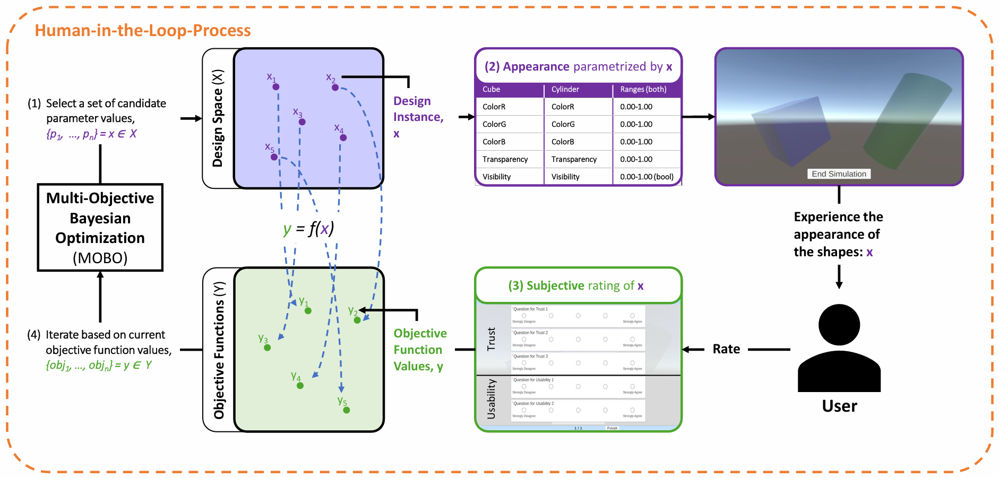
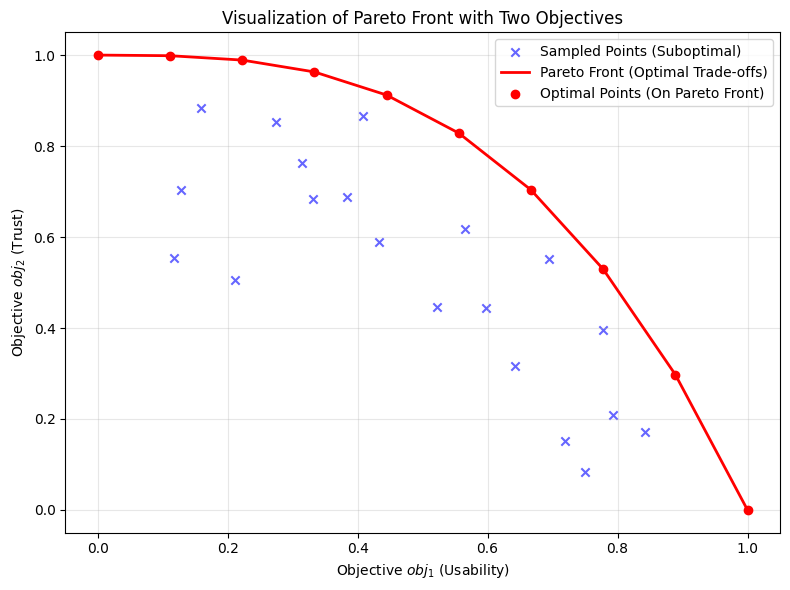
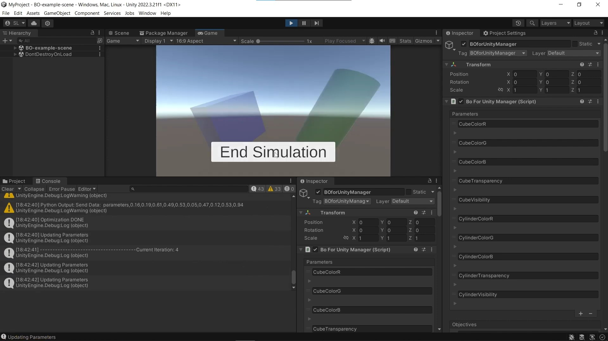
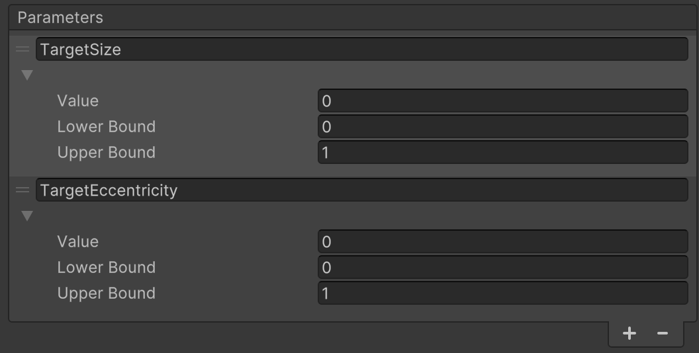
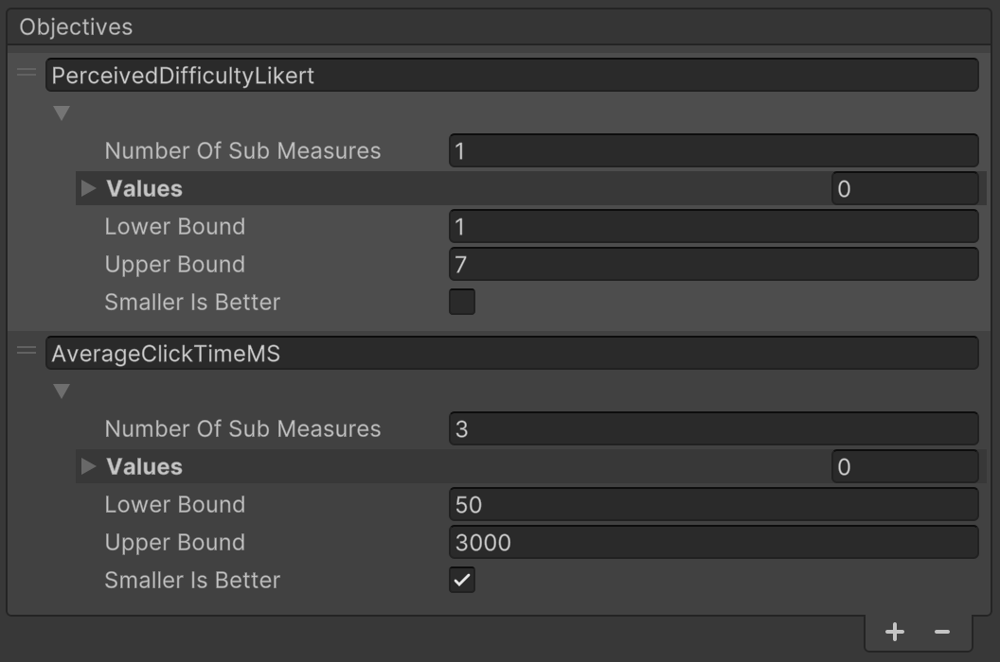
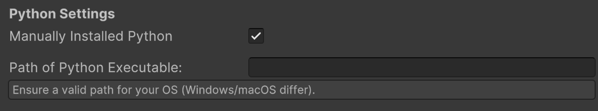
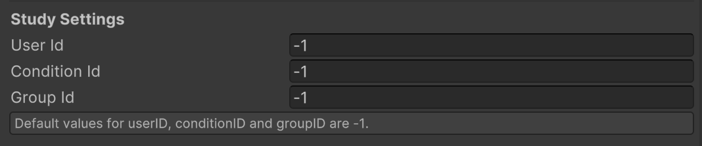
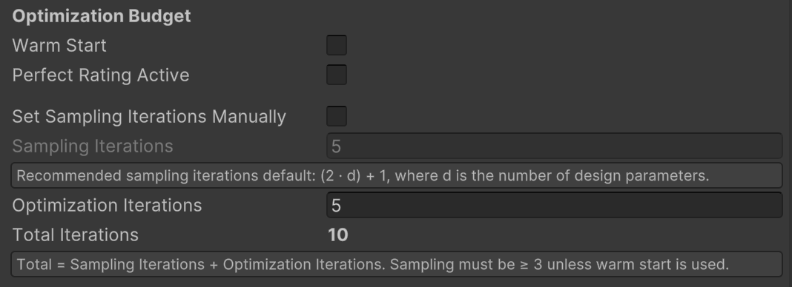
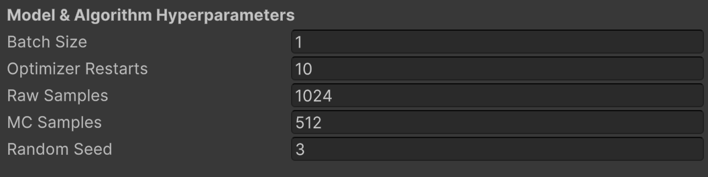
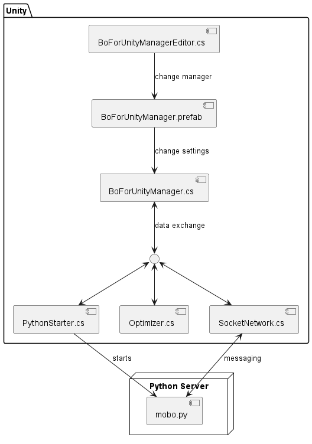

# Bayesian Optimization for Unity

[](https://doi.org/10.5281/zenodo.19786494)

**[Pascal Jansen](https://pascal-jansen.github.io)**, Ulm University

**[Mark Colley](https://m-colley.github.io)**, University College London


## About

This Unity asset provides an end-to-end, **Human-in-the-Loop (HITL) Bayesian Optimization** workflow (single- and multi-objective) built on [botorch.org](https://botorch.org/). It lets you declare **design parameters** and **objectives** in Unity, runs a Python backend, and loops with users inside your Unity scene. The result is an efficient search over large design spaces, yielding trade-off designs on the **Pareto front**.

**Why this matters.** Users typically have diverse preferences, needs, and abilities. Thus, manual design parameter tuning is often slow and potentially biased; A/B and grid search scale poorly. Instead, MOBO uses probabilistic surrogate models and principled acquisition to balance design exploration and exploitation, **reducing the number of user trials** required to achieve a high-quality design for individuals.

### Key Features

- Configure design parameters, objectives, and optimizer hyperparameters directly in Unity.
- Automatic, robust communication with a [BoTorch](https://botorch.org/)-based MOBO process.
- MOBO metric calculations use [moocore](https://github.com/multi-objective/moocore) for Pareto-front and hypervolume utilities.
- Cost-aware BO backend (CABOP) for cases where design evaluations have different costs, with single-objective and scalarized multi-objective modes; see Langerak et al.'s [Cost-Aware Bayesian Optimization for Prototyping Interactive Devices](https://dl.acm.org/doi/full/10.1145/3772318.3791024) for background.
- Built-in integration with the [QuestionnaireToolkit](https://assetstore.unity.com/packages/tools/gui/questionnairetoolkit-157330) for explicit feedback in a HITL process; compatible with implicit telemetry.
- Automatic CSV logging of parameters/objectives and optimization metric traces (hypervolume for MOBO, best-objective trace for BO); warm-start from prior runs.
- Unified log routing below `Assets/StreamingAssets/BOData/LogData/<USER_LOG_ID>/<CONDITION_LOG_ID>/`, including QuestionnaireToolkit CSVs and app-specific telemetry.
- Ready-to-run example scenes, including questionnaire-driven design optimization and a 2D Fitts law pointing task based on Fitts's [1954 paper](https://doi.org/10.1037/h0055392).
- Fitts law study support for `HITL MOBO`, `Static`, and `Random` conditions in one scene, with explicit design parameters, objective telemetry, and per-condition logs.

### Example Use Case

To improve interface usability, treat selected UI attributes as **design parameters** $x$ (e.g., button size, color contrast, spacing, animation duration) and optimize two **objectives** $y$: **System Usability Scale** (0–100, maximize) and **task completion time** (seconds, minimize). In each iteration $t$, the optimizer proposes a configuration $x_t$; a participant completes a fixed task; Unity records time; the participant completes SUS; the posterior and acquisition function update; and the next $x_{t+1}$ is selected. After several iterations, the system returns an estimated Pareto front containing *Pareto-optimal* interface designs that represent the best compromise between the design objectives.


---

## Publications

Several scientific publications have used **Bayesian Optimization for Unity**:

[OptiCarVis: Improving automated vehicle functionality visualizations using Bayesian optimization to enhance user experience](https://dl.acm.org/doi/full/10.1145/3706598.3713514). In *Proceedings of the 2025 CHI Conference on Human Factors in Computing Systems*. **CHI '25**. ACM.
  **Best Paper Honorable Mention (top 5%)**

[Improving external communication of automated vehicles using Bayesian optimization](https://dl.acm.org/doi/full/10.1145/3706598.3714187). In *Proceedings of the 2025 CHI Conference on Human Factors in Computing Systems*. **CHI '25**. ACM.

[Fly Away: Evaluating the impact of motion fidelity on optimized user interface design via Bayesian optimization in automated urban air mobility simulations](https://dl.acm.org/doi/full/10.1145/3706598.3713288). In *Proceedings of the 2025 CHI Conference on Human Factors in Computing Systems*. **CHI '25**. ACM.

[ProVoice: Designing proactive functionality for in-vehicle conversational assistants using multi-objective Bayesian optimization to enhance driver experience](https://dl.acm.org/doi/full/10.1145/3772318.3791877). In *Proceedings of the 2026 CHI Conference on Human Factors in Computing Systems*. **CHI '26**. ACM.


---

## Contents

* [About](#about)
  * [Key Features](#key-features)
  * [Example Use Case](#example-use-case)
* [Publications](#publications)
* [1. Glossary](#1-glossary-plain-language)
* [2. Background](#2-background)
  * [2.1 Optimization Problem](#21-optimization-problem)
  * [2.2 Human-in-the-Loop Process](#22-human-in-the-loop-process)
  * [2.3 Questionnaires for User Feedback](#23-questionnaires-for-user-feedback)
  * [2.4 Results of Multi-Objective Bayesian Optimization](#24-results-of-multi-objective-bayesian-optimization-pareto-front)
* [3. Installation](#3-installation)
* [4. Integration Checklist](#4-integration-checklist-required)
* [5. Quick Start](#5-quick-start-10-minutes)
* [6. Example Usage](#6-example-usage)
  * [6.1 Questionnaire Demo Scene](#61-questionnaire-demo-scene)
  * [6.2 Fitts Law Task Scene](#62-fitts-law-task-scene)
    * [6.2.1 Condition Modes](#621-condition-modes)
    * [6.2.2 Design Parameters](#622-design-parameters)
    * [6.2.3 Objectives and Questionnaire Items](#623-objectives-and-questionnaire-items)
    * [6.2.4 Runtime Behavior](#624-runtime-behavior)
    * [6.2.5 Logging](#625-logging)
* [7. Demo Video](#7-demo-video)
* [8. Configuration](#8-configuration)
  * [8.1 Parameters](#81-parameters)
  * [8.2 Objectives](#82-objectives)
  * [8.3 Get Parameter Values via Code](#83-get-parameter-values-via-code)
  * [8.4 Set Objective Values via Code](#84-set-objective-values-via-code)
  * [8.5 Python Settings](#85-python-settings)
  * [8.6 Study Settings](#86-study-settings)
  * [8.7 Optimizer Backend and CABOP Settings](#87-optimizer-backend-and-cabop-settings)
  * [8.8 Questionnaire Prior Rating Hint](#88-questionnaire-prior-rating-hint-optional)
  * [8.9 Problem Setup](#89-problem-setup)
  * [8.10 Optimization Budget](#810-optimization-budget)
  * [8.11 Model and Algorithm Hyperparameters](#811-model-and-algorithm-hyperparameters)
  * [8.12 Output Files and Metrics](#812-output-files-and-metrics)
* [9. Troubleshooting](#9-troubleshooting)
* [10. System Architecture](#10-system-architecture)
* [11. Portability to Your Own Project](#11-portability-to-your-own-project)
* [12. Citation](#12-citation)
* [13. License](#13-license)

---

## 1. Glossary (Plain Language)

| Term | Meaning |
|---|---|
| **Parameter** | A setting Unity can change automatically (for example size, color, speed). |
| **Objective** | A score the optimizer tries to improve (for example usability, trust, completion time). |
| **Smaller is Better** | Unity flag for an objective where lower values are preferred (for example time or errors). |
| **Sampling Iterations** | Initial rounds used to explore the space before model-based optimization starts. |
| **Optimization Iterations** | Main BO rounds where the model proposes the next best design. |
| **Warm Start** | Start from existing CSV data instead of collecting new initial samples. |
| **Pareto Front** | Best trade-offs when you have multiple objectives and no single best point exists. |
| **Dominated Point** | A point that is worse than another point in all objectives (and strictly worse in at least one). |
| **Hypervolume** | Single MOBO progress metric computed from current non-dominated points in maximize-space. |
| **coverage** | Runtime metric sent from Python to Unity (`hypervolume` for MOBO, best objective for BO). |
| **tempCoverage** | Sampling-progress value in `[0,1]` during initial sampling rounds. |
| **USER_LOG_ID** | Folder-safe log identifier derived from `User ID` (invalid path characters are normalized). |
| **Seed** | Number used to make stochastic parts reproducible across runs with the same setup. |


---

## 2. Background

### 2.1 Optimization Problem

In MOBO, the goal is to find a parameter configuration (e.g., color, transparency, visibility) that maximizes objective values (e.g., usability, trust) while respecting the design space ($`X`$). The optimizer explores feasible designs to identify the best trade-offs among multiple objectives.

The optimization problem is:

$$
x^* = \arg\max_{x \in X} f(x),
$$

where:
- $x$ is a parameter vector in $X$,
- $f(x)$ is a vector of objectives, $f(x) = [f_1(x), f_2(x), \dots, f_k(x)]$,
- $x^*$ maximizes $f(x)$ over $X$.

Here, $f(x)$ is also denoted as $y$ and represents user responses to the system (e.g., questionnaire answers). The optimizer seeks the $x^*$ that yields the best outcomes.

### 2.2 Human-in-the-Loop Process

The figure below shows the HITL process for this asset.
Step by step:
1. **Design Selection:**
   The optimizer selects a design instance $x$ from the design space ($X$). In the example, a design includes color (ColorR, ColorG, ColorB), transparency, and visibility of the shapes (Cube & Cylinder). Parameter ranges limit $X$.
2. **Simulation:**
   The appearance parameterized by $x$ is shown in the simulation so the user can experience the design.
3. **User Feedback:**
   After the simulation, the user rates the design via a questionnaire. Ratings are translated into objective values $y$. In the example, the objectives are trust and usability, each with defined ranges ($Y$).
4. **Optimization:**
   Based on current objective values, [MOBO](#24-results-of-multi-objective-bayesian-optimization-pareto-front) proposes another design, considering prior feedback. The loop repeats.

<a id="hitl_diagram"></a>



The entire process consists of two phases:

* **Sampling Phase:**\
Sobol sampling (see note) selects evenly spread designs across the space. The optimizer records objective values to learn the landscape before optimization starts. In these rounds, visual changes may not correlate with ratings.

> **Note:** I. M. Sobol. 1967. On the distribution of points in a cube and the approximate evaluation of integrals. U.S.S.R. Comput. Math. and Math. Phys. 7 (1967), 86–112. ([DOI](https://doi.org/10.1016/0041-5553(67)90144-9))

* **Optimization Phase:**\
The optimizer balances **exploitation** (refining known good regions) and **exploration** (searching new regions).


### 2.3 Questionnaires for User Feedback

This asset uses the [QuestionnaireToolkit](https://assetstore.unity.com/packages/tools/gui/questionnairetoolkit-157330) to collect explicit subjective feedback. This feedback serves as a design objective in the HITL process.

#### 2.3.1 Questionnaire Data Routing (Important)

- Only questionnaire question-item outputs are considered for BO objective updates (via objective-key/header matching).
- `additionalCsvItems` are written only to the questionnaire results CSV and are **not** forwarded to the BO manager/backend. `QTQuestionnaireManager` automatically adds `UserID`, `ConditionID`, and `GroupID` as additional CSV items so they are visible in the inspector and appear in every questionnaire CSV.
- `User ID`, `Condition ID`, and `Group ID` are not BO objectives. They are logged as context columns in `ObservationsPerEvaluation.csv`.
- Questionnaire result CSVs always include `UserID`, `ConditionID`, and `GroupID`. `QTQuestionnaireManager` reads them from `BoForUnityManager` when available; scenes without an active BO manager can set the fallback values in *QTQuestionnaireManager* -> *BO Context Logging*.
- Final-design selection uses the full context triad (`User ID`, `Condition ID`, `Group ID`) when filtering candidate observation rows.
- The bundled `QTQuestionnaireManager` now defaults its `resultsSavePath` to `Assets/StreamingAssets/BOData/LogData/`, and writes results below `LogData/<USER_LOG_ID>/<CONDITION_LOG_ID>/`, so raw QuestionnaireToolkit CSV output stays with the BO logs instead of `persistentDataPath`.
- In app scenes that use the Fitts law task, `speed` and `accuracy` are added as extra questionnaire CSV columns. They are telemetry columns for analysis consistency; the BO objective values still come from the task script and the subjective questionnaire items.
- Do not create `UserID`, `ConditionID`, `GroupID`, `speed`, or `accuracy` as normal questionnaire questions. They should be Additional CSV Items only.


### 2.4 Results of Multi-Objective Bayesian Optimization (Pareto Front)

MOBO can optimize for multiple, potentially conflicting objectives. Rather than a single optimum, it identifies the **Pareto front**, representing the best trade-offs.

A solution is **Pareto optimal** if no other solution improves one objective without worsening another. The diagram below illustrates this.



The x-axis shows the first objective (usability) and the y-axis the second (trust). As in the [HITL diagram](#hitl_diagram), both axes are objective values ($y$). Each point is one observed $y$ from ($Y$). Points on the curve are Pareto optimal; points inside are dominated.

MOBO uses surrogate models (e.g., Gaussian processes) to approximate objectives, enabling efficient prediction. An acquisition function (e.g., Expected Hypervolume Improvement) selects the next points, trading off performance gains and exploration.

In short, the optimizer maximizes $y$ by proposing parameter vectors expected to perform best next.

MOBO is used in hyperparameter tuning, materials discovery, and engineering design where multiple objectives matter.

---

## 3. Installation

Set up the asset as follows:
1. Clone the repository.
2. Run `installation_python.bat` (Windows) or `install_python.sh` (macOS) to install Python and required libraries.
   Files are in *Assets/StreamingAssets/BOData/Installation*.
3. Install Unity Hub.
4. Create or log in to your (student) Unity account.
5. Install Unity 2022.3.21f1 or higher. We recommend Unity 6.2 or newer.
6. Add the project to Unity Hub by selecting the repository folder.
7. Open the project and set the [Python Settings](#85-python-settings).

> **Note:** You may set the Python path manually if you already have a local Python installation. See [Python Settings](#85-python-settings). Also, read [Configuration](#8-configuration) to ensure settings are saved.

---

## 4. Integration Checklist (Required)

Before running your own scene, verify the following minimum setup:

1. `BOforUnityManager` object exists in the scene and has the tag `BOforUnityManager`.
2. The same object contains these components:
   - `BoForUnityManager`
   - `PythonStarter`
   - `SocketNetwork`
   - `Optimizer`
   - `MainThreadDispatcher`
3. In `BoForUnityManager`, required references are assigned:
   - `Output Text`
   - `Loading Obj`
   - `Welcome Panel`
   - `Optimizer State Panel`
4. If `Iteration Advance Mode = NextButton`, `Next Button` is assigned and wired to `BoForUnityManager.ButtonNextIteration()`.
5. If `Iteration Advance Mode = ExternalSignal`, your UI/game logic calls:
   ```csharp
   var bo = GameObject.FindWithTag("BOforUnityManager").GetComponent<BoForUnityManager>();
   bo.RequestNextIteration();
   ```
6. Every objective key in `BoForUnityManager` has a matching data source (questionnaire item or manual script assignment).
7. If you use QuestionnaireToolkit mapping, each question `Header Name` matches the objective key exactly.
8. Parameter and objective keys are unique (no duplicates).
9. Python settings are valid (`Manually Installed Python` path or automatic detection works).

If any item above is missing, the loop may start but stall before sending/receiving valid optimization data.


---

## 5. Quick Start (10 Minutes)

Use this path for a first successful run with the provided demo scene.

1. Open `Assets/BOforUnity/Scenes/BO-example-scene.unity`.
2. Select `BOforUnityManager` in the hierarchy and verify the [Integration Checklist](#4-integration-checklist-required).
3. In `BoForUnityManager` inspector:
   - keep `Iteration Advance Mode = NextButton`
   - keep `Warm Start = false`
   - keep `Seed = 3`
4. Set `Optimizer Backend = BoTorch` and confirm there are at least two objectives (`m >= 2`) so `mobo.py` is used.
5. Press Play.
6. Click `Next` to start initialization.
7. Wait for "The system has been started successfully!".
8. Click `Next` to start an evaluation.
9. Run the simulation flow and click `End Simulation`.
10. Complete the questionnaire and click `Finish`.
11. Repeat at least one more iteration.

Expected successful outcome:
- Parameter values in the scene change between iterations.
- `Assets/StreamingAssets/BOData/LogData/<USER_LOG_ID>/<CONDITION_LOG_ID>/` is created.
- `ObservationsPerEvaluation.csv` and `ExecutionTimes.csv` are populated.
- For MOBO (`m >= 2`), `HypervolumePerEvaluation.csv` is written and Unity receives `coverage` updates.

If these outputs appear, your full Unity-Python loop is working.


---

## 6. Example Usage

This section walks through the provided example workflows. Install the asset first as described in [Installation](#3-installation).
> **Note:** *ObservationsPerEvaluation.csv* must be empty (except for the header). Find it below *Assets/StreamingAssets/BOData/LogData/&lt;USER_LOG_ID&gt;/&lt;CONDITION_LOG_ID&gt;/*. By default these equal `User ID` and `Condition ID`, but invalid path characters are normalized for folder safety. You can delete the condition folder to recreate clean logs.

### 6.1 Questionnaire Demo Scene

Use this scene when you want to see the standard QuestionnaireToolkit-based HITL workflow.

1. In Unity, open *Assets/BOforUnity/Scenes* and double-click *BO-example-scene.unity*.
2. Press the Play button (⏵).
3. Click `Next`, wait for loading, then click `Next` again.
4. The simulation appears. You will see up to two colored shapes to evaluate.
5. When finished, click `End Simulation`. A questionnaire appears.
6. Answer, then press `Finish`. The optimizer saves your input and updates parameters.
7. Press `Next` to start a new iteration. Repeat from step `3` until all iterations finish. The system then indicates you can close the application.

> **Note:** Results are in *Assets/StreamingAssets/BOData/LogData/&lt;USER_LOG_ID&gt;/&lt;CONDITION_LOG_ID&gt;/* (typically your `User ID` and `Condition ID`, normalized for folder-safe naming if needed).

### 6.2 Fitts Law Task Scene

Use `Assets/BOforUnity/Scenes/BO-fitts-law-task.unity` for all Fitts law study conditions. The task presents circular click targets arranged on a ring. One target is highlighted at a time, contains an `X` marker, and the participant clicks the highlighted target to advance to the next trial. The implementation lives in `Assets/BOforUnity/Examples/FittsLawTask.cs`; condition orchestration lives in `Assets/BOforUnity/Examples/FittsLawConditionManager.cs`.

The scene now covers all three study conditions in one scene. Separate static/random scenes are not needed.

#### 6.2.1 Condition Modes

The scene contains a `FittsLawConditionManager`. Set its `Condition Mode` in the inspector:

| Condition Mode | Behavior |
|---|---|
| `HITL MOBO` | Adaptive BO design. The BO manager stays active, Python proposes new parameter values, and the questionnaire advances the BO loop through `ExternalSignal`. |
| `Static` | Fixed design. The BO runtime is disabled and the serialized values on `FittsLawTask` are used for every round. |
| `Random` | Random baseline. The BO runtime is disabled and a fresh random design is sampled for every task round. |

When `Set Condition ID From Mode` is enabled, the manager writes these condition IDs automatically:

| Condition Mode | ConditionID |
|---|---|
| `HITL MOBO` | `HITL MOBO` |
| `Static` | `static` |
| `Random` | `random` |

For static and random runs, configure `UserID` and `GroupID` on `FittsLawConditionManager`. The manager mirrors all three IDs into `QTQuestionnaireManager` at runtime, so questionnaire CSVs, app telemetry, and BO logs share the same context columns.

For static and random conditions, `FittsLawConditionManager` reads the same sampling/optimization iteration counts as the BO setup and runs one additional local `finaldesign` round when `includeFinalDesignRound` is enabled. This keeps the baseline conditions aligned with the adaptive BO condition while keeping the optimizer inactive. For example, with `3` sampling iterations and `2` optimization iterations, static/random run `5 + 1 finaldesign` task rounds.

#### 6.2.2 Design Parameters

The scene is configured as a BO example with five scalar design parameters:

| Parameter key | Default bounds | Meaning |
|---|---:|---|
| `x_font_size` | `18..64` | Font size of the fixed `X` marker inside the target, in pixels. |
| `button_size` | `40..120` | Target button diameter in pixels. This replaces the old `circle_size` parameter. |
| `button_distance` | `464..760` | Movement distance / ring diameter in pixels. This replaces the old `circle_distance` parameter. |
| `button_hue` | `0..1` | Button color hue in HSB/HSV space. |
| `button_saturation` | `0..1` | Button color saturation in HSB/HSV space. |

Brightness is intentionally not optimized. `FittsLawTask.buttonColorBrightness` is fixed at `0.5` and applied together with `button_hue` and `button_saturation`.

The Fitts law task only applies BO values whose keys are present in the `BoForUnityManager.parameters` list. Removing a key from that inspector list leaves the corresponding Fitts law value fixed at the value serialized on `FittsLawTask`. This is intentional: visual/task settings should not change unless they are explicitly defined as design parameters in the BO inspector.

Other Fitts visual properties, such as target count, target order, movement direction, target outline, background, and wrong-click flash, are not BO design parameters in the provided setup. The target outline is disabled by default (`targetOutlineWidth = 0`), and wrong-target red flashing is disabled by default (`wrongTargetFlashSeconds = 0`).

`button_distance` is constrained so adjacent targets cannot overlap. For the default `targetCount = 12` and maximum `button_size = 120`, the lower bound is `464 px` because the ring diameter must be at least `button_size / sin(pi / targetCount)`. Runtime layout safety checks also clamp applied values if a manually edited design would otherwise overlap or exceed the play area.

The random condition samples from the same five parameter ranges listed above. It also keeps brightness fixed at `0.5`.

#### 6.2.3 Objectives and Questionnaire Items

The scene writes four objectives:

| Objective key | Direction | Meaning |
|---|---|---|
| `aesthetics` | Maximize | Single-item aesthetics rating. |
| `speed` | Minimize | Raw total task time in ms, configured with bounds `0..30000`. |
| `accuracy` | Minimize | Raw mean click distance to the current target center in pixels, configured with bounds `0..1300`. |
| `usability` | Maximize | Average of the two usability slider items, for example `usability1` and `usability2`. |

Unity writes raw objective values to `BoForUnityManager`; the BO backend normalizes them using the objective lower/upper bounds from the inspector. The speed upper bound uses 30,000 ms because the default task has 10 trials, making 3 seconds per click the upper range before backend clamping. The accuracy upper bound uses 1300 px, derived from the default 1920 x 1080 reference resolution, 120 x 96 play-area padding, and max ring diameter of 760 px; this covers the farthest relevant click-to-target-center distance in the default task layout.

Speed and accuracy should therefore be configured in raw units in the Unity inspector. Do not pre-normalize them in Unity; the Python backend performs normalization from the configured objective bounds.

The subjective questionnaire items must be created manually in the scene. `FittsLawTask` does not create or duplicate QuestionnaireToolkit items at runtime. Use QuestionnaireToolkit slider items whose `Header Name` values match the objective keys. For multi-item objectives, use submeasure headers such as `usability1` and `usability2`; these map to the single `usability` objective and are averaged according to its `numberOfSubMeasures`. No additional UMUX-LITE or SUS regression formula is applied by the task; if you want a specific transformed scale, configure the questionnaire item scale/objective bounds accordingly.

The Fitts questionnaire result CSV also includes `speed` and `accuracy` as Additional CSV Items. This makes static, random, and HITL MOBO questionnaire files comparable, even though speed and accuracy are measured by the task script rather than answered by the participant.

#### 6.2.4 Runtime Behavior

Correct target clicks advance to the next target. Wrong target clicks and play-area misses are logged and counted, but they do not advance the trial. Wrong target flashing is disabled in the provided scene.

Workflow:

1. Open `Assets/BOforUnity/Scenes/BO-fitts-law-task.unity`.
2. Select `Fitts Law Condition Manager` and set `Condition Mode`.
3. Press Play.
4. For `HITL MOBO`, wait for the optimizer to initialize. For `Static` and `Random`, the local condition starts without Python optimization.
5. Click each highlighted target until the trial block is complete.
6. Rate aesthetics and usability.
7. In `HITL MOBO`, the script writes objective values to `BoForUnityManager`, starts optimization, and requests the next external-signal iteration automatically. In `Static` and `Random`, `FittsLawConditionManager` starts the next local round after the questionnaire.

#### 6.2.5 Logging

The Fitts law scene also writes detailed app telemetry to `Assets/StreamingAssets/BOData/LogData/<USER_LOG_ID>/<CONDITION_LOG_ID>/`. `FittsLawAppLog.csv` stores one aggregate row per task round, including the ID triad, timestamp, iteration, phase, click counts, timing, accuracy, active design parameters, and objective values. `FittsLawTrialLog.csv` stores one row per completed target trial with the same context columns plus target/click positions and per-trial wrong-click counts. If the optional legacy `writeResultsCsv` flag is enabled, that CSV is written to the same condition folder.

All files for one participant run are grouped under one user folder and then separated by condition:

```text
Assets/StreamingAssets/BOData/LogData/
  <USER_LOG_ID>/
    HITL MOBO/
      Questionnaire-*.csv
      FittsLawAppLog.csv
      FittsLawTrialLog.csv
      run/ObservationsPerEvaluation.csv
    static/
      Questionnaire-*.csv
      FittsLawAppLog.csv
      FittsLawTrialLog.csv
    random/
      Questionnaire-*.csv
      FittsLawAppLog.csv
      FittsLawTrialLog.csv
```

If the requested user folder already exists, BOforUnity creates a suffix such as `<USER_LOG_ID>_1`, `<USER_LOG_ID>_2`, and so on. This prevents accidental overwrites while still keeping the three condition folders together for the same run.

This example is useful for HCI experiments where movement amplitude, button size, marker size, button color, objective pointing performance, and subjective single-item ratings should be optimized together. For the original model, see Fitts's 1954 paper, [The Information Capacity of the Human Motor System in Controlling the Amplitude of Movement](https://doi.org/10.1037/h0055392).

---

## 7. Demo Video

Click the thumbnail for a short demo showing how to export the main-branch package and import it into a new Unity project. It also shows what to do after import if you have an up-to-date Python (currently, we recommend 3.13.7) on Windows. You can also open the video in the *images* folder.
> **Note:** This video shows a previous version of this asset's user interface in Unity. The procedure is similar for the current version.

[](https://www.youtube.com/watch?v=J1hrFuiGiRI)

<!---->

---

## 8. Configuration

All configuration is done in Unity. Open *Assets/BOforUnity/Scenes/BO-example-scene.unity*. Select the *BOforUnityManager* object in the hierarchy, then click *Select* at the top of the inspector. Adjust settings as needed.

Save the scene after changes. Re-select *BOforUnityManager* to confirm your edits. The *BOforUnityManager* prefab must be correct; it overrides previous settings (see the inspector top left).

> **Note:** All configuration lives in this object. The options below follow the inspector from top to bottom.
> **Note:** If you add or remove parameters/objectives, back up and clear the current user log folder to regenerate CSV headers.


### 8.1 Parameters

Parameters are automatically adjusted by the system during optimization. This section shows how to create, change, or remove parameters before runtime.

#### 8.1.1 Create Parameter

Click `+` at the bottom of the parameter list to add a prefilled entry, then edit it as described [here](#812-adjust-parameter-in-the-unity-inspector).

> **Note:** Ensure the new parameter is used by your simulation.

> **Note:** If headers are out of sync, back up logs in *Assets/StreamingAssets/BOData/LogData/&lt;USER_LOG_ID&gt;/&lt;CONDITION_LOG_ID&gt;/* and then delete the condition folder to refresh headers.

> **Note:** If you use the [warm start option](#8101-warm-start-settings), ensure CSV headers match after adding parameters.

#### 8.1.2 Adjust Parameter in the Unity Inspector

Adjustable options, top to bottom:

| **Name**              | **Description**                                                                   |
|-----------------------|-----------------------------------------------------------------------------------|
| **Value**             | Value assigned by the optimizer in each sampling/optimization iteration.          |
| **Lower/Upper Bound** | Bounds that restrict the parameter.                                               |
| **CABOP Group**       | Parameter group used by CABOP for group-wise cost modeling (`default` if empty). |
| **CABOP Tolerance**   | Matching tolerance for reuse/swap decisions in CABOP (`>= 0`).                   |
| **CABOP Prefabricated Values** | Optional discrete values for CABOP snapping (nearest value is used). |

<a id="parameter_settings"></a>


#### 8.1.3 Remove Parameter

Select the parameter by clicking the `=` icon in its top-left corner (it turns blue). Click `-` at the bottom to remove it.

> **Note:** Ensure the removed parameter is **not** used in your simulation.

> **Note:** If headers are out of sync, back up and remove the condition log folder *Assets/StreamingAssets/BOData/LogData/&lt;USER_LOG_ID&gt;/&lt;CONDITION_LOG_ID&gt;/*.


### 8.2 Objectives

Objectives are sent to the optimizer as feedback in each iteration. You can create, change, or remove objectives.

#### 8.2.1 Create Objective

Click `+` at the bottom of the objective list to add a prefilled entry, then edit it as described [here](#822-change-objective).

> **Note:** Each objective must receive a value before optimization. In the demo, create a new questionnaire item or map an existing one to the objective (see below).

> **Note:** If headers are out of sync, back up logs in *Assets/StreamingAssets/BOData/LogData/&lt;USER_LOG_ID&gt;/&lt;CONDITION_LOG_ID&gt;/* and then delete the condition folder.

> **Note:** For [warm start](#8101-warm-start-settings), CSV headers must match after adding objectives.

##### 8.2.1.1 Create Question

In *BO-example-scene* hierarchy, go to *QTQuestionnaireManager/QuestionPage-1*. In *Question Item Creation*, set the inputs (the *Header Name* must match the objective name), then click *Create Item*. Edit as needed.

##### 8.2.1.2 Change Existing Question

In *QTQuestionnaireManager/QuestionPage-1/Scroll View/Viewpoint/Content/*, select the question and set its *Header Name* to the objective name.

#### 8.2.2 Change Objective

Options, top to bottom:

| **Name**                       | **Description**                                                                                      |
|--------------------------------|------------------------------------------------------------------------------------------------------|
| **Number of Sub Measures**     | Number of values for this objective (e.g., count of questions). **Must be >= 1**.                    |
| **Values**                     | Values populated after the questionnaire is completed.                                               |
| **Lower/Upper Bound**          | Bounds that restrict the objective values.                                                           |
| **Smaller is Better**          | Whether lower values are preferable (default: higher is better).                                     |
| **CABOP Weight**               | Weight used only in CABOP multi-objective scalarization (must be `> 0`).                            |
<a id="objective_settings"></a>



#### 8.2.3 Remove Objective

Select the objective by clicking the `=` icon in its top-left corner (turns blue). Click `-` at the bottom to remove it.

> **Note:** Reverse the steps you performed when adding the objective.

### 8.3 Get Parameter Values via Code

You can read the current parameter values each iteration by indexing into the *parameter* list on the *BOforUnityManager* instance.
Here is an example snippet:
```csharp
// assuming you have a reference to the manager
BoForUnityManager bo = GameObject.Find("BOforUnityManager").GetComponent<BoForUnityManager>();

var i = 0;
// during an iteration, read the i-th parameter
float value = bo.parameters[i].value.Value;

// or loop through all parameters
for (int j = 0; j < bo.parameters.Count; j++) {
   var parameter = bo.parameters[j];
   Debug.Log($"Parameter {j} ({parameter.key}) = {parameter.value.Value}");
}
```
This gives you programmatic access to the parameter settings that the optimizer proposes.
The index follows the order of the parameter list visible in the Unity inspector view.

### 8.4 Set Objective Values via Code

By default, *QuestionnaireToolkit* updates objective values in each iteration.
If you want to override or set them manually, you can write into the *objective* list on the *BOforUnityManager* instance.
Example:
```csharp
BoForUnityManager bo = GameObject.Find("BOforUnityManager").GetComponent<BoForUnityManager>();

var i = 0;
// during an iteration, assign the i-th objective
// this assumes that there is only one sub-measure for this objective:
var myScore = 1.5f;
bo.objectives[i].value.values[0] = myScore;

// if you want to assign more than one sub-measure use the following...
// their average value will be sent to the optimizer as a single value for this objective
var myScoreA = 7.1f;
var myScoreB = 10f;
var myScoreC = 3.24f;
bo.objectives[i].value.values[0] = myScoreA;
bo.objectives[i].value.values[1] = myScoreB;
bo.objectives[i].value.values[2] = myScoreC;

// the following lines are necessary if you did not define the number of sub-measures in the inspector view
bo.objectives[i].value.numberOfSubMeasures = 3;
bo.objectives[i].value.values.Add(myScoreA);
bo.objectives[i].value.values.Add(myScoreB);
bo.objectives[i].value.values.Add(myScoreC);

// or multiple objectives
for (int j = 0; j < bo.objectives.Count; j++) {
   bo.objectives[j].value.values[0] = myScore + j;
   Debug.Log($"Objective {j} ({bo.objectives[j].value.values[0]}) = {myScore + j}");
}
```
The index follows the order of the objective list visible in the Unity inspector view.
Make sure you assign objective values before the optimizer proceeds so that the backend receives the feedback correctly.


### 8.5 Python Settings

**Default**:
If you leave `Manually Installed Python` unchecked, the system will automatically search for a valid Python path in the OS and install the requirements via pip.
If only an older Python is found, the runtime now attempts to install the preferred target runtime (`3.13.x`) first (platform installer prompt may appear), then continues setup.
On macOS the runtime auto-install path uses the bundled Python `.pkg` installer payload. The `install_python.sh` script remains available for manual terminal setup.
The runtime now validates Python versions (`3.13+` supported) and prefers the bundled `3.13.7` runtime automatically when it is installed.
If the target-runtime installation is cancelled or fails, startup is aborted with a clear error instead of silently continuing on the old interpreter.

You can **override** this behavior by checking `Manually Installed Python` and following the steps below:
 1. Open a terminal and search for Python installations:
    * Windows: `where python`
    * Linux/macOS: `which python3`
    Copy the path to a compatible Python (`3.13+`, ideally the bundled `3.13.7` runtime).
 2. In *BOforUnityManager* → *Python Settings*, check the box
 3. Paste the path in the `Path of Python Executable` field.




### 8.6 Study Settings

Set `User ID`, `Condition ID`, and `Group ID` in the inspector section shown in the [image](#py_st_ws_pr_settings).
If your study does not use any of these IDs, leave the field at -1. The value will still be logged, but you can ignore it in analysis.
These three values are always logged as context columns in `ObservationsPerEvaluation.csv` and are used together for final-design row filtering.

The same ID triad is also routed into QuestionnaireToolkit through Additional CSV Items. In the standard BO scenes, `QTQuestionnaireManager` reads these values from the active `BoForUnityManager`. In Fitts law baseline conditions where the BO manager is disabled, `FittsLawConditionManager` supplies the context instead.

Log folders are created below `Assets/StreamingAssets/BOData/LogData/`. The user folder is a folder-safe version of `User ID`; invalid path characters are replaced. If that user folder already exists for a new run, BOforUnity uses a suffix such as `_1` or `_2` to prevent overwriting prior data. Condition folders are then created inside that selected user folder.



### 8.7 Optimizer Backend and CABOP Settings

`BoForUnityManager` now supports two backends:

* **BoTorch**: existing behavior (`bo.py` for single-objective, `mobo.py` for multi-objective). In `mobo.py`, BoTorch handles the GP model and acquisition function, while [moocore](https://github.com/multi-objective/moocore) computes Pareto flags and hypervolume metrics.
* **CABOP**: cost-aware optimization backend with selectable objective mode:
  * `SingleObjective` -> `cabop_bo.py` (requires exactly 1 objective).
  * `MultiObjectiveScalarized` -> `cabop_mobo.py` (requires at least 2 objectives; objectives are scalarized to one minimized score).

CABOP addresses the practical case where design changes do not all have the same evaluation cost. For the broader cost-aware BO motivation and terminology, see Langerak, Zhang, Wang, Kristensson, and Oulasvirta's [Cost-Aware Bayesian Optimization for Prototyping Interactive Devices](https://dl.acm.org/doi/full/10.1145/3772318.3791024).

CABOP inspector settings:

* **CABOP Use Cost Aware Acquisition**: enables EI-per-cost behavior.
* **CABOP Update Rule**: `Actual` (recommended), `Intended`, or `Both`.
* **CABOP Enable Cost Budget** + **CABOP Max Cumulative Cost**: optional stopping criterion in addition to iteration counts.
* **CABOP Group Costs**: group-level `unchanged/swapped/acquired` costs for both model cost (`cost`) and realized cost (`actual_cost`).

API equivalents are available directly on `BoForUnityManager` fields:
* `optimizerBackend`
* `cabopObjectiveMode`
* `cabopUseCostAwareAcquisition`
* `cabopUpdateRule`
* `cabopEnableCostBudget`
* `cabopMaxCumulativeCost`
* `cabopGroupCosts`
* Parameter-level CABOP fields in `parameters[i].value`:
  * `cabopGroup`
  * `cabopTolerance`
  * `cabopPrefabricatedValues`
* Objective-level CABOP field in `objectives[i].value`:
  * `cabopWeight`

**What “prefabricated values / prefab snapping” means here**
This is **not** a Unity prefab asset reference. In CABOP, “prefab” means a predefined list of numeric parameter values that already exist (for example, already manufactured/fabricated settings). If a list is provided for a parameter, CABOP snaps proposals to the nearest listed value before sending parameters to Unity.

### 8.8 Questionnaire Prior Rating Hint (Optional)

In `BoForUnityManager` (Inspector), you can enable **Show Prior Rating Hint**.

Behavior:
- On slider questions (`QTSlider`) and Likert/linear scale questions (`QTLinearScale`), the questionnaire shows a subtle marker indicating the participant's previous rating for that same question.
- The question is still reset to unanswered for the new iteration. The hint is visual-only and does not submit an answer.
- If no previous rating exists yet, no hint is shown.

Bias control:
- Use **Hint Opacity** to keep the marker subtle (recommended range: low opacity).
- This helps users calibrate relative to their last response while minimizing anchoring pressure.

Technical note:
- The hint is keyed per questionnaire and question identity (slider/Likert) and persists across BO iterations during the same app run.


### 8.9 Problem Setup

Here, the current setup of design parameters (d) and design objectives (m) is shown as defined in the parameter and objectives list in the inspector. This serves as an overview to decide the optimization budget below.

Backend selection:
* `Optimizer Backend = BoTorch`
  * `m = 1` uses `bo.py`.
  * `m >= 2` uses `mobo.py`.
* `Optimizer Backend = CABOP`
  * `CABOP Objective Mode = SingleObjective` uses `cabop_bo.py`.
  * `CABOP Objective Mode = MultiObjectiveScalarized` uses `cabop_mobo.py`.
  * CABOP internally minimizes a scalar objective. For multi-objective mode, scalarization uses objective bounds, direction (`Smaller is Better`), and `CABOP Weight`.


### 8.10 Optimization Budget

These options are in the lower part of this [image](#py_st_ws_pr_settings).

#### 8.10.1 Warm Start Settings

* Checking **Warm Start** skips the initial rounds. Optimization starts from prior results supplied as CSVs, formatted like the examples in *Assets/StreamingAssets/BOData/BayesianOptimization/InitData*.
* Copying a prior *ObservationsPerEvaluation.csv* into the new study’s log folder is optional and only needed if you want one continuous observation log across runs.
* Leaving it unchecked uses the default start. After the specified number of initial iterations (minimum 2), optimization begins using the collected values.
* **Warm Start Objective Format** controls how objective values in the warm-start objective CSV are interpreted:
  * `auto` (default): detect format automatically.
  * `raw`: values are in original objective bounds (`Lower/Upper Bound`), then converted internally.
  * `normalized_max`: values are already normalized to `[-1, 1]` in maximize-space.
  * `normalized_native`: values are normalized to `[-1, 1]` in native objective direction (entries with `Smaller is Better` are flipped internally).

> **Note:** CSV formats for warm start **must** match the examples. Headers must match the current number of parameters and objectives. Using logs from a prior study with the same settings satisfies this.

#### 8.10.2 Warm-Start CSV Checklist (Required)

* Both files must be in *Assets/StreamingAssets/BOData/BayesianOptimization/InitData* and referenced by file name in the inspector.
* Parameter CSV headers must exactly match parameter keys; objective CSV headers must exactly match objective keys.
* Parameter and objective CSVs must have the same number of rows and at least one row.
* All values must be numeric and finite (no `NaN`/`Inf`).
* For best compatibility, provide parameter values in original parameter bounds (`Lower/Upper Bound`).
* Objective values must follow the selected **Warm Start Objective Format**.

#### 8.10.3 Warm-Start CSV Examples

The examples below use `;` as delimiter and require headers that match your exact parameter/objective keys.

`raw` (original bounds):

```csv
ButtonSize;Contrast
0.35;0.70
0.55;0.40
```

```csv
Usability;TaskTime;ErrorCount
72;38;4
68;31;3
```

`normalized_max` (already in maximize-space `[-1,1]`):

```csv
ButtonSize;Contrast
0.35;0.70
0.55;0.40
```

```csv
Usability;TaskTime;ErrorCount
0.44;0.36;0.60
0.36;0.48;0.70
```

`normalized_native` (native direction `[-1,1]`, Python flips minimize objectives internally):

```csv
ButtonSize;Contrast
0.35;0.70
0.55;0.40
```

```csv
Usability;TaskTime;ErrorCount
0.44;-0.36;-0.60
0.36;-0.48;-0.70
```

#### 8.10.4 Objective Direction Semantics

* Internally, the optimizer always works in maximize-space.
* If **Smaller is Better** is enabled for an objective, the backend flips that objective internally.
* This flip is applied consistently in optimization, Pareto computation, and logging conversions.

#### 8.10.5 Objective Direction Example (2 Minimize, 1 Maximize)

Assume these three Unity objectives:

| Objective Key | Bounds | Smaller is Better | Example Raw Value | Internal Maximize-Space Value |
|---|---|---|---|---|
| `TaskTime` | `[0, 120]` | `true` | `30` | `+0.50` |
| `ErrorCount` | `[0, 20]` | `true` | `4` | `+0.60` |
| `Usability` | `[0, 100]` | `false` | `70` | `+0.40` |

How this is handled:
1. Values are normalized to `[-1,1]`.
2. Objectives with `Smaller is Better = true` are multiplied by `-1`.
3. Pareto checks (`is_non_dominated`) and hypervolume are computed on this consistent maximize-space representation.
4. `ObservationsPerEvaluation.csv` stores denormalized values in your original objective units.

`mobo.py` uses [moocore](https://github.com/multi-objective/moocore) for these Pareto and hypervolume calculations. BoTorch is still used for the surrogate model, acquisition function, and next-design proposal.

#### 8.10.6 Perfect Rating Settings

* Disabled by default.
* Enable **Perfect Rating** to terminate when a perfect rating is achieved.
* If **Perfect Rating In Initial Rounds** is checked (visible only when perfect rating is active), a perfect rating can also terminate during sampling.

#### 8.10.7 Iteration Progression Settings

* **Iteration Advance Mode** controls how the next evaluation iteration starts:
  * `NextButton`: legacy behavior (user presses the assigned Next button).
  * `ExternalSignal`: no built-in button dependency; trigger progression from your own logic.
  * `Automatic`: starts the next iteration automatically after a configurable delay.
* **Automatic Advance Delay (s)** is used only in `Automatic` mode.
* **Reload Scene On Advance** controls whether the manager reloads the active scene when progressing.
  * Keep this enabled for the default sample-loop behavior.
  * Disable it if your app handles iteration transitions without scene reloads.

For `ExternalSignal`, call this from your own UI/event logic:

```csharp
var bo = GameObject.FindWithTag("BOforUnityManager").GetComponent<BoForUnityManager>();
bo.RequestNextIteration();
```

If you use the bundled `QTQuestionnaireManager`, this request is queued automatically after questionnaire completion when `Iteration Advance Mode` is set to `ExternalSignal`.

#### 8.10.8 Final Design Round (Optional)

If **Enable Final Design Round** is active, the system adds one extra participant-facing round after BO completes.

What happens:
1. The Python backend finishes normal BO iterations and sends `optimization_finished`.
2. Unity reads the latest `ObservationsPerEvaluation.csv` for the current context (`User ID`, `Condition ID`, `Group ID`).
3. Unity deterministically selects one final design and applies its parameter values.
4. The user runs one final round (`totalIterations + 1`), but this round does **not** send objectives back to Python and does not continue optimization.
5. Unity appends this last evaluation to `ObservationsPerEvaluation.csv` with `Phase=finaldesign` and marker column `IsPareto`/`IsBest` set to `NULL`.

Selection logic (deterministic):
1. Normalize each objective via min-max over all CSV rows, after objective direction handling (`Smaller is Better` is internally flipped).
2. Primary criterion: smallest Euclidean distance to utopia (`[1,1,...,1]`) in normalized objective space.
3. Tie-break 1: largest maximin (maximize the worst normalized objective).
4. Tie-break 2: least-aggressive parameter profile (smallest L2 distance to parameter baseline in normalized parameter space; baseline uses parameter-range midpoints).
5. Tie-break 3: earliest iteration index.

Candidate rows:
* MOBO: rows flagged by `IsPareto` are preferred.
* BO: rows flagged by `IsBest` are preferred.
* If no preferred rows exist, all rows are considered.

Inspector controls:
* **Enable Final Design Round**: activates the feature.
* **Utopia Distance Epsilon**, **Maximin Epsilon**, **Aggression Epsilon**: tolerances for deterministic tie handling.

Integration note:
* If you use `QTQuestionnaireManager`, finishing the final round still triggers its normal completion flow.
* `BoForUnityManager` detects that this is the final non-BO round and ends the loop without sending objectives to Python.

<a id="py_st_ws_pr_settings"></a>

| **Name**       | **Default Value** | **Description**                                                                                   |
|-----------------|-------------------|---------------------------------------------------------------------------------------------------|
| **Sampling Iterations**   | [2(d+1)](https://botorch.org/docs/tutorials/constrained_multi_objective_bo/)   | Number of sampling iterations before optimization; the recommended value is `2 * (Number of Design Parameters + 1)`. You can overwrite this default by checking `Set Sampling Iterations Manually`.              |
| **Optimization Iterations**|                 | Number of iterations used to refine results; here, the actual optimization takes place.                       |
| **Total Iterations** |            | Sum of `Sampling Iterations` and `Optimization Iterations`. This is how long the HITL process will run in total.                                                           |




### 8.11 Model and Algorithm Hyperparameters

The hyperparameters affect how efficiently the optimizer searches the space. The adjustable hyperparameters are shown in this [image](#BO_hyper_settings).

| **Name**       | **Default Value** | **Description**                                                                                   | **More Information**                                                                                                   |
|-----------------|-------------------|---------------------------------------------------------------------------------------------------|------------------------------------------------------------------------------------------------------------------------|
| **Batch Size**  | 1                 | Number of evaluations performed in parallel. **Current HITL implementation supports only `1`; larger values are forced to `1` at runtime.** | [Batch Size Explanation](https://mljourney.com/how-does-batch-size-affect-training/)                                   |
| **Num Restarts**| 10                | Optimization restarts to escape local optima.                                                     |                                                                                                                        |
| **Raw Samples** | 1024              | Random samples to initialize acquisition optimization.                                            |                                                                                                                        |
| **MC Samples**  | 512               | Monte Carlo samples to approximate the acquisition function.                                      | [MC Samples Explanation](https://www.sciencedirect.com/topics/mathematics/monte-carlo-simulation)                      |
| **Seed**        | 3                 | Random seed for reproducibility.                                                                  | [Seed Explanation](https://en.wikipedia.org/wiki/Random_seed)                                                          |


> **Note:** Recommended default: `Sampling Iterations = 2(d + 1)`, where `d` is the number of design parameters. Warm start sets sampling iterations to `0`.
<a id="BO_hyper_settings"></a>




### 8.12 Output Files and Metrics

All runtime logs are grouped by participant/run and condition under `Assets/StreamingAssets/BOData/LogData/`.

The general layout is:

```text
LogData/
  <USER_LOG_ID>/
    <CONDITION_LOG_ID>/
      Questionnaire-*.csv
      <optional app-specific logs>
      run/
        ObservationsPerEvaluation.csv
        ExecutionTimes.csv
        HypervolumePerEvaluation.csv or BestObjectivePerEvaluation.csv
      CABOP/
        single/run/
        multi/run/
```

`<USER_LOG_ID>` and `<CONDITION_LOG_ID>` are folder-safe versions of `User ID` and `Condition ID`. If a new run would reuse an existing user folder, BOforUnity creates a suffixed folder such as `<USER_LOG_ID>_1` to avoid overwriting. Within that user folder, all condition-specific files are written below their condition folder.

BO/backend run files are written to:
* *Assets/StreamingAssets/BOData/LogData/&lt;USER_LOG_ID&gt;/&lt;CONDITION_LOG_ID&gt;/run/*
* *Assets/StreamingAssets/BOData/LogData/&lt;USER_LOG_ID&gt;/&lt;CONDITION_LOG_ID&gt;/CABOP/single/run/* (CABOP single-objective runs)
* *Assets/StreamingAssets/BOData/LogData/&lt;USER_LOG_ID&gt;/&lt;CONDITION_LOG_ID&gt;/CABOP/multi/run/* (CABOP multi-objective-scalarized runs)
* Legacy runs may exist under *&lt;Unity persistentDataPath&gt;/BOData/LogData/&lt;USER_LOG_ID&gt;/* or *Assets/StreamingAssets/BOData/BayesianOptimization/LogData/&lt;USER_LOG_ID&gt;/*; final-design selection checks those locations too.

Common files:
* `ObservationsPerEvaluation.csv`: denormalized parameter/objective observations per evaluation.
* `ExecutionTimes.csv`: optimization-step runtimes.
* QuestionnaireToolkit raw result CSVs default to *Assets/StreamingAssets/BOData/LogData/&lt;USER_LOG_ID&gt;/&lt;CONDITION_LOG_ID&gt;/* and include `UserID`, `ConditionID`, and `GroupID`.
* The Fitts law scene additionally writes `FittsLawAppLog.csv` and `FittsLawTrialLog.csv` to the same condition folder. Its questionnaire CSV also includes measured `speed` and `accuracy` columns.

MOBO (`mobo.py`, `m >= 2`):
* `ObservationsPerEvaluation.csv` uses `IsPareto`.
* `HypervolumePerEvaluation.csv` stores hypervolume per iteration.
* Unity `coverage` corresponds to current hypervolume.

Single-objective BO (`bo.py`, `m = 1`):
* `ObservationsPerEvaluation.csv` uses `IsBest`.
* `BestObjectivePerEvaluation.csv` stores best-so-far objective per iteration.
* `HypervolumePerEvaluation.csv` is also written for backward compatibility (mirrors the best-objective trace).
* Unity `coverage` corresponds to current best normalized objective.

CABOP (`cabop_bo.py` / `cabop_mobo.py`):
* Logs are separated under each user's condition folder in `CABOP/single` and `CABOP/multi`.
* `ObservationsPerEvaluation.csv` is reused (`IsBest` for single mode, `IsPareto` marker column for multi mode).
* `ExecutionTimes.csv` is reused.
* `CABOPMetricsPerEvaluation.csv` stores scalarized objective trace and realized/cumulative cost.
* Compatibility metric file:
  * single mode: `BestObjectivePerEvaluation.csv`
  * multi mode: `HypervolumePerEvaluation.csv` (stores CABOP coverage trace for compatibility)
* Unity `coverage` is `1 - best_scalarized_objective` (higher is better).

During sampling, Unity `tempCoverage` is a progress value in `[0,1]`.


---

## 9. Troubleshooting

| Symptom | Likely Cause | Fix |
|---|---|---|
| "The system could not be started..." in Unity | Python path/setup failed or dependencies are missing | Re-check [Python Settings](#85-python-settings), rerun installer scripts in `Assets/StreamingAssets/BOData/Installation`, then restart Unity. |
| Loop stalls after questionnaire `Finish` | Objective values were not assigned, or objective keys do not match questionnaire headers | Verify each objective key is mapped and receives a value each iteration. |
| Loop does not progress in `ExternalSignal` mode | `RequestNextIteration()` is not called from your custom flow | Add the explicit call after your evaluation step ends. |
| Loop does not progress in `NextButton` mode | `Next Button` not assigned or not wired to `ButtonNextIteration()` | Assign the button reference and Unity `OnClick` event to `BoForUnityManager.ButtonNextIteration()`. |
| Warm start fails on startup | Missing CSV files, wrong headers, non-numeric values, or wrong format setting | Validate files against [Warm-Start CSV Checklist (Required)](#8102-warm-start-csv-checklist-required) and [Warm-Start CSV Examples](#8103-warm-start-csv-examples). |
| `ObservationsPerEvaluation.csv columns mismatch` error | Existing log file schema no longer matches current parameters/objectives | Back up and remove `Assets/StreamingAssets/BOData/LogData/<USER_LOG_ID>/<CONDITION_LOG_ID>/`, then rerun to regenerate headers. |
| No parameter changes between iterations | Simulation does not apply incoming parameter values from `bo.parameters` | Confirm your scene reads and applies updated parameter values each iteration. |
| `coverage`/Pareto behavior seems inconsistent with minimize objectives | Misunderstanding of internal maximize-space conversion | See [Objective Direction Semantics](#8104-objective-direction-semantics) and [Objective Direction Example (2 Minimize, 1 Maximize)](#8105-objective-direction-example-2-minimize-1-maximize). |
| Fitts law questionnaire says required items are missing | Aesthetics/usability slider items are not present or their `Header Name` values do not match the objective keys/submeasure names | Create the items manually in the scene. Use `aesthetics` and either `usability` or submeasure headers such as `usability1` and `usability2`. |
| Fitts law target buttons overlap | `button_distance` is too small for the current `button_size`/`targetCount`, or values were edited outside the recommended ranges | Use the default constrained bounds or increase `button_distance`. The runtime clamps unsafe layouts, but the inspector bounds should still be kept feasible. |
| Logs appear under a suffixed user folder such as `_1` | A folder with the requested `User ID` already existed | This is expected overwrite protection. Use the suffixed folder as the current run's user folder. |
| Questionnaire CSV is not in the same condition folder as app/BO logs | `QTQuestionnaireManager.resultsSavePath` or `Save Results In BO Context Folders` was changed | Set `resultsSavePath` to `Assets/StreamingAssets/BOData/LogData/` and keep `Save Results In BO Context Folders` enabled. |

---

## 10. System Architecture

This section explains the architecture to help you extend the asset. The diagram below summarizes the flow.



At the top is *BoForUnityManagerEditor.cs*, which edits the *BoForUnityManager.prefab* (what can be set and how it is described). The prefab’s settings are configured in the Unity Inspector as explained in [Configuration](#8-configuration).\
*BoForUnityManager.cs* manages the process and first starts the Python server via *PythonStarter.cs*.\
Once the server is running, *BoForUnityManager.cs* communicates with the selected backend script (*bo.py*/*mobo.py* or *cabop_bo.py*/*cabop_mobo.py*) using *SocketNetwork.cs*.\
After receiving data from *SocketNetwork.cs*, it passes it to *Optimizer.cs*, which updates simulation parameters.\
*BoForUnityManager.cs* also tracks the current iteration and orchestrates the loop.

---

## 11. Portability to Your Own Project

To reuse this tool in another project, export it as a Unity package:
1. In the Unity hierarchy, ensure you are in *Assets*.
2. `Assets` → **Export Package...**
3. Click **None** to deselect all files.
4. Select:
   - *BOforUnity*
   - *QuestionnaireToolkit*
   - *StreamingAssets*
5. Click **Export...** and save the package.

To import: `Assets` → **Import Package** → **Custom Package...**, select your package, keep all selected, and press **Import**.

> **Note:** Avoid spaces in the project path; otherwise, the Python script may not resolve paths correctly.

> **Note:** On first use of *TextMeshPro*, install *TextMeshPro-Essentials* when prompted. Refresh the scene if needed.

---

## 12. Citation

If you use this software, please cite:

```bibtex
@software{jansen_bayesian_optimization_for_unity,
  author    = {Pascal Jansen and Mark Colley},
  title     = {Bayesian Optimization for Unity},
  publisher = {Zenodo},
  doi       = {10.5281/zenodo.19786494},
  url       = {https://doi.org/10.5281/zenodo.19786494}
}
```


---

## 13. License

This project is under the **MIT License**, available in the repository folder containing this README.
